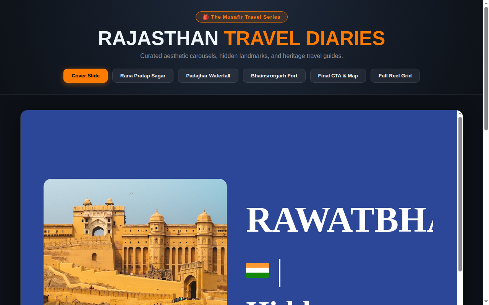

# 🎒 Travel Content Studio & Multi-Slide Carousel Generator

[](https://en.wikipedia.org/wiki/HTML5)
[](LICENSE)
[](https://github.com/themusafirr)
[](https://github.com/themusafirr)

> Production-ready travel content studio producing multi-slide aesthetic carousels, responsive travel diary stories, and viral YouTube shorts layouts spotlighting Rajasthan's hidden gems, forts, lakes, and heritage architecture.


<div align="center">
  <br/>
  
  <br/>
</div>

---


## 🌟 Highlights & Content Engine

- 🏰 **Curated Rajasthan Heritage Collection:** High-resolution architectural and scenic photography covering Jaipur, Rawatbhata, Udaipur, and Thar desert outposts.
- 📱 **Adaptive HTML5 Carousel Studio:**
  - Responsive multi-slide layouts (`carousel.html` and modular `slide1.html` through `slide5.html`).
  - Seamlessly exportable to high-DPI vertical (9:16) and square (1:1) formats for Instagram & YouTube.
- 🎥 **Video Cover & Thumbnail Workflows:** Pre-formatted hero banners (`cover.jpg`) and slide sequences for high-CTR thumbnails.

---

## 🚀 Quick Start

### View & Preview Slides Locally
```bash
git clone https://github.com/themusafirr/travel-carousel-content-studio.git
cd travel-carousel-content-studio
# Launch local preview server
python3 -m http.server 8080
```
Open `http://localhost:8080/carousel.html` in your browser.

---

## 📁 Repository Structure

```
├── .gitignore          # Excludes large raw video binaries (.mp4) and logs
├── README.md           # Documentation & guides
├── carousel.html       # Master multi-slide presentation layout
├── slide1.html - slide5.html  # Standalone individual slide cards
└── photos/ & *.jpg     # High-resolution heritage and landscape assets
```

---

## 💼 Creative Automation & Media Services

Looking for automated travel content generation, video editing pipelines, or digital storytelling systems?

- 💬 **Telegram:** [@the_musafir](https://t.me/the_musafir)
- 🌐 **GitHub:** [@themusafirr](https://github.com/themusafirr)

---

## 📄 License
MIT License. Built by [themusafirr](https://github.com/themusafirr).
